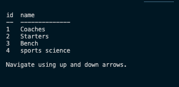
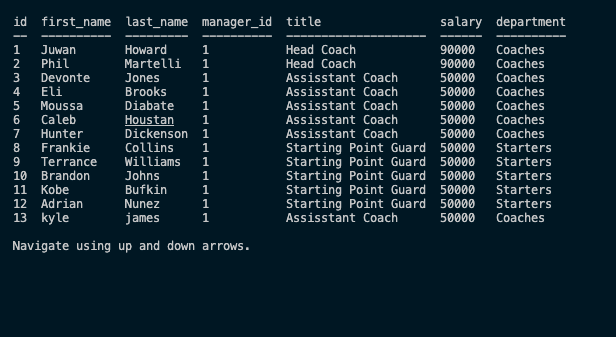
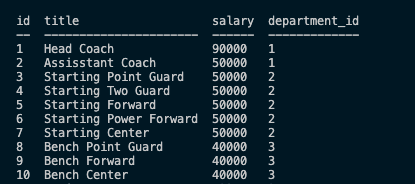

# trackin-the-employees-SQL

It allows the user (manager) to add/view/delete departments, employees and roles.

[Live link to deployed video adding departments, employees and roles](https://youtu.be/Q8DxCfZsGSU)

### Sources

1. Heroku

2. node.js

3. JavaScript

4. Express

[Live link to Github Repository](https://github.com/kylejames20/relax-and-take-notes)